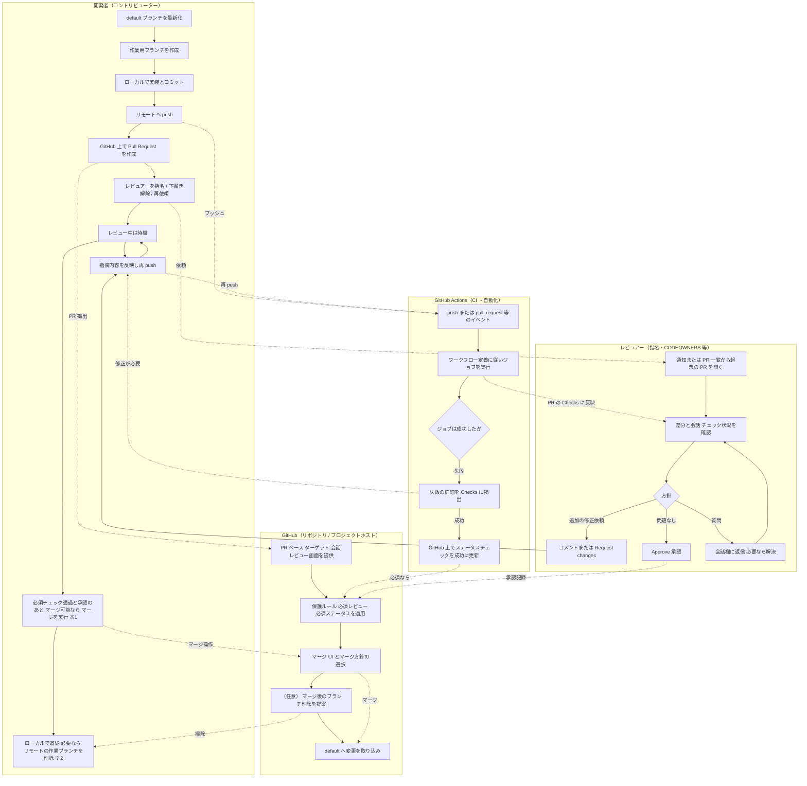

# Hello, MkDocs from nuitsjp

## 箇条書き

### 番号なし

- Item A
- Item B

### 番号あり

1. Item 1
2. Item 2
    1. Item 2.1

## テーブル

|rows|column1|column2|
|--|--|--|
|row1|1-1|1-2|
|row2|2-1|2-2|

## 画像

## GitHub Pull Request を用いたレビューワークフロー

※1 多くのチームでは PR 作者やレビュアーなど **書き込み権限＋ポリシー** を満たした人がマージします。  
※2 リモートのブランチ削除は、GitHub 上の「Delete branch」やリポジトリ設定に委ねる場合もあります。

## SVG

